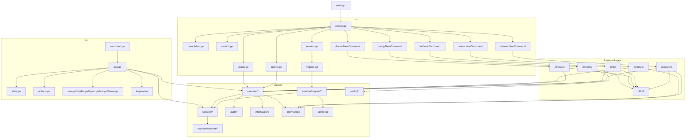

# codexsm Architecture Notes

## Current Status

`codexsm` is organized as a layered CLI/TUI application over shared session domain logic.

Recent refactors now in-tree:

- CLI command-heavy areas moved into subpackages: `cli/config`, `cli/delete`, `cli/doctor`, `cli/list`, `cli/restore`, `cli/util`.
- Session migration command file renamed and consolidated as `cli/migrate.go`.
- Usecase delete/restore orchestration split into explicit modules: `usecase/delete.go`, `usecase/restore.go`, `usecase/action_exec.go`, `usecase/batch_policy.go`.
- TUI preview index/build/load flow fully lives in `tui/preview/*` without root-level preview bridge wrappers.
- Local pass-through aliases/wrappers removed where they did not add domain meaning.

## Layered Topology

## Package Responsibilities

1. Entry and command wiring
- `main.go`, `cli/root.go`, `cli/session.go`.

2. CLI command execution
- root commands in `cli/*.go`.
- command implementations in `cli/config`, `cli/delete`, `cli/doctor`, `cli/list`, `cli/restore`.
- shared CLI helpers in `cli/util`.

3. TUI behavior and rendering
- `tui/app.go` is Bubble Tea event/update/view orchestration.
- `tui/state.go` and `tui/actions.go` hold state transitions and destructive-action flows.
- `tui/preview/*` owns preview build/cache/index/load/persist logic.

4. Domain orchestration and storage
- `usecase/*` contains command-facing orchestration logic and policies.
- `session/*` contains session scan/filter/delete/restore domain operations.
- `session/scanner/*` isolates scanning/head parsing.
- `session/migrate/*` isolates migration batch/index/sql/rollout behavior.
- `audit/*` owns action log format and rollback id lookup.
- `config/*` owns runtime path/config resolution.

## Dependency Rules

- `cli` and `tui` may depend on `usecase`, `session`, `config`, `internal/ops`, `cli/util`.
- `usecase` may depend on `session`, `audit`, `internal/core`, `internal/ops`.
- `tui/preview` is a leaf utility package under `tui` and must not depend on `cli`.
- `session/scanner` and `session/migrate` are leaf subpackages under `session`.
- `util/file.go` remains a low-level helper; do not build domain policy there.
- Do not add pass-through wrappers or type aliases unless they provide clear stable boundary semantics.

## Runtime/Build Notes

- Required: `GOEXPERIMENT=jsonv2`.
- JSON stack: `encoding/json/v2`, `encoding/json/jsontext`.
- Coverage gate (`just cover-gate`):
  - unit `>= 60%`
  - integration (`./cli`) `>= 72%`
